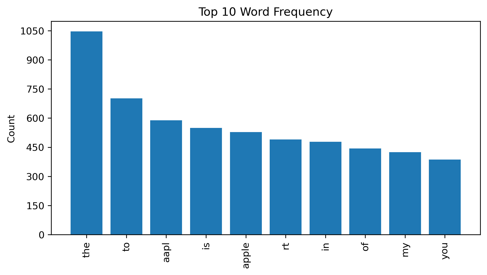
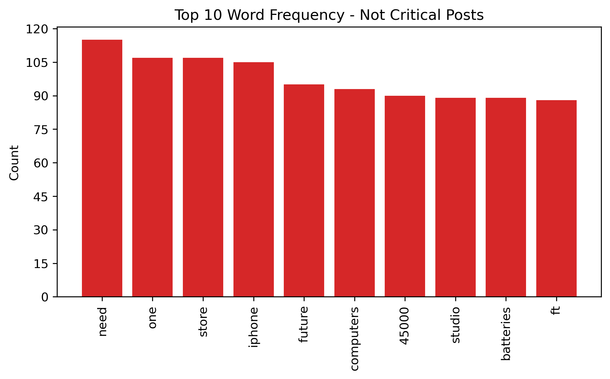
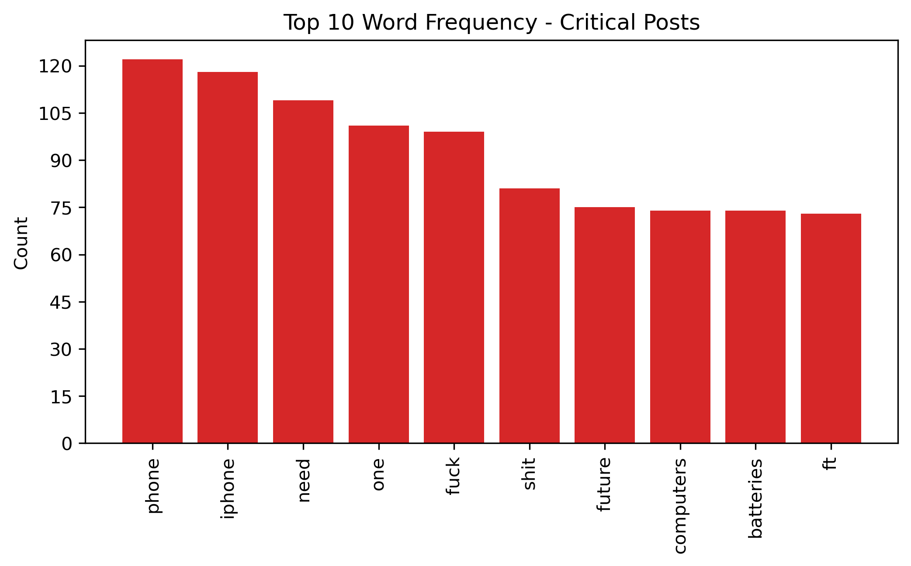

# Natural Language Processing - Apple Sentiment
by Michael Kearns


# Business Understanding

Customer relations and approval is highly valued at the Tech Sales Company (TSC). Currently, TSC sells Apple products and we want to decide if we should continue to market and supply Apple products to our customers. If customers no longer like Apple, we want to separate ourselves from the brand and show our loyalty to our customers and promote other products. To track what customers do not like about Apple, we plan to develop a natural language processing model that can identify if a customer's post is critical and should be reviewed later. Non critical posts will be considered posts that do not provide negative or useful information that can help show what our customers do not like about Apple. 

# Data Understanding

To train and test this machine learning model, data from [Crowdflower](https://www.kaggle.com/datasets/slythe/apple-twitter-sentiment-crowdflower) will be used. This dataset includes nearly 4,000 X posts that reference Apple from December, 2014. The primary features that will be used are the "Sentiment" and "Text" features that include the posts and that user's sentiment toward Apple, rated from 1-3 scale.

## Data Preparation

From the original dataset, only the "sentiment" and "text" columns will be retained for this model. All other columns can be removed as they are not needed to train or test the model on. In the "sentiment" column, the ratings are 1, 3, and 5. The background information provided by the datasource confirms that the meanings of ranking are 1 - Negative, 3 - Neutral, 5 - Positive.

Based on the buisness problem, the model is to determine if a post is "critical" or "not critical". That makes this a binary problem and the sentiment values need to be adjusted to accommadte a binary classification. 3 or "Neutral" posts will be considered "not critical", and to maintain a balanced distribution, 800 random posts from the 3 classification will be converted to 5 ratings. Then the 5's will be converted to 0's for simplicity so that the model can classify posts as 0 - "not critical" or 1 - "critical". Posts that have a "not_relevant" sentiment will be removed as they only make up 2% of the data set. After this redistribution of data, the model will still have over 2000 posts to train and test on which is sufficient.

Data also needs to simplified and cleaned. Initial steps to preprocess the text will be to convert all letters in a post to lowercase. Mentions, ie. @..., URLS, hashtags, special characters, and extra whitespaces will be removed. The user mentions will be primarily directed at Apple which is not signifcant as all posts in this data are in reference towards Apple. URLS are long and not semantic content.

# Exploratrory Data Analysis

To make the text more suitable for a machine learning model, the text needs to be tokenized. This will be done using the **nltk** module. This step will also help us understand common words from user posts.



The frequency list does not seem very meaningful yet. It may be worth reviewing the top 10 word frequency betweent the critical and not critical posts.


Stopwords seem to be very repeatable among the two types of posts. They should be removed to make the tokens more distinct. "Apple", "aapl", and "rt" are commonly appearing as well. "Apple" and "aapl" do not provide much value as all posts within this data is regarind Apple. "Rt" is appearing a lot most likely becuase people posts are from reposting others original posts. These will be added to the stopwords list so that they can be removed.




# Modeling

## Baseline Model 

For the baseline model a Naive Bayes Model will be used. When checking for critical and not critical posts, it is more beneficial to minimize the number of false negatives. Therefore, the recall score of the model should be considered.

Training Recall:  0.88
Testing Recall:  0.

The baseline model has high recall scores between both the training and testing data. This shows that model is performing well. The training data has a slightly larger recall score which means the model is slightly overfitting to the training model. However, this is not a large difference and the high testing recall score is still good. 

## Model 2: Lemmatizing Words

For the second iteration of the model, the tokens will be lemmatized to see if this can improve the model's performance.

Model 2 Training Recall:  0.88
Model 2 Testing Recall:  0.79

Results are very similar to Model 1.

## Model 3: Random Forest Model

For the next iteration, a more complex Random Forest Model will be used to test if this improves model performance. GridsearchCV will also be utilized to help tune parameters of the Random Forest Classifier.

Mean Training Recall Score: 77.08%
Mean Test Recall Score: 79.79%
Mean Val Recall Score: 72.55%
Best Parameter Combination Found During Grid Search: {'RF__max_depth': 3, 'RF__min_samples_leaf': 4, 'RF__min_samples_split': 2, 'RF__n_estimators': 200}

The training and test scores are very close to each other and still close to 80%. This shows that the model is performing well and is not overfitting. The Validation score is a bit lower but still within 5% of the training recall score so this shows that the selected best parameter combination will produce a quality model.

## Final Model

The final model will be based on the results of the previous iterations. The random forest model with the optimized parameters will be chosen for the final model. It had the lowest training recall score but showed the least amount of overfitting and balanced performance between training and testing recall score. The recall score on the validation set also shows that the paratemers are properly tuned.

Training Recall:  0.82
Testing Recall:  0.8


# Conclusion

## Recommendations

As shown in the final model, a Random Forest classifier model has performed the best with optimized parameters. This model showed a recall score of 82% and 80% on the training and testing data respectively. That means that among all the posts that are actually "Critical" (True Positives + False Negatives), the model was able to identify 80% as "critical". Now when classifying user X posts, TSC can easily review the posts that will have pertinent sentiment towards Apple and the company will be able to make an informed decision about whether or not to continue to sell and promote Apple products.

## Limitations

The dataset only contained posts from a specific time period. The model is not trained on or considers information from other periods of time so it may only work best for posts coming from a similar time period. It will be better to continually evaluate the model as Apple offers new generations of products and people mention those in their posts.


## Next Steps

* Evaluate the model yearly to ensure the the model has been trained on information that is relevant to current Apple products and current customer sentiment.
* Consider incorporating Apple reviews on other websites.
* Review posts that are classified as Critical to determine whether customers want to continue to buy Apple products from TSC.

## Repository Structure
```
├── data
├── images
├── README.md
├── presentation.pdf
└── notebook.ipynb
```
